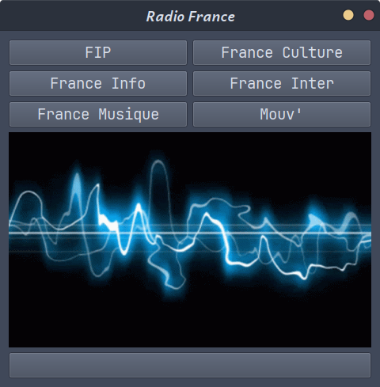

# PyRadio

  

## Présentation

Lecteur de radios de [Radio France](https://www.radiofrance.fr/). 

Simple application développée avec [QtForPython](https://doc.qt.io/qtforpython-6/), qui permet de lancer une des six radios et de mettre en pause la lecture. Image *.gif* intégrée pour créer un aspect dynamique.

### English translation

[Radio France](https://www.radiofrance.fr/) radio player. 

Simple application developed with [QtForPython](https://doc.qt.io/qtforpython-6/), allowing you to launch one of six radio stations and pause playback. Integrated *.gif* image to create a dynamic look.
